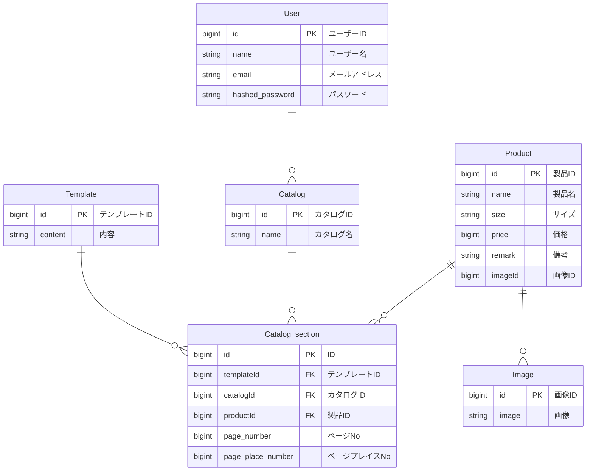
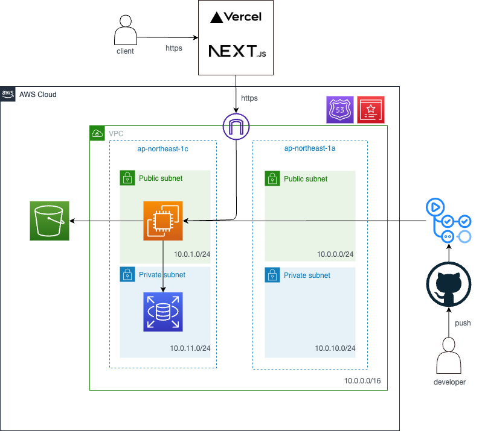

# 設計図
* [ワークフロー](#ワークフロー)
* [ワイヤーフレーム](#ワイヤーフレーム)
* [ER図](#ER図)
* [テーブル定義書](#テーブル定義書)
* [アーキテクチャ図](#アーキテクチャ図)

## ワークフロー
### 作成するアプリの基本的な業務フロー
1. 担当者が商品情報を用意する
     * 商品情報は商品名と価格とサイズと画像を含む
2. 商品情報を入力する
3. 写真を一括でインポートする
4. 使用するテンプレートを選択する
5. 入力したものをカタログ上に配置していく
6. PDFでエクスポートする

## ワイヤーフレーム
https://www.figma.com/file/prsf09jxB4aCHbqncDo4gw/catalog-easy?type=design&node-id=0%3A1&mode=design&t=sO7GbaSMpRPOZhVo-1

## ER図

## テーブル定義書
### User テーブル
| フィールド名 | データ型 | キー | 説明         | null許容 |
|----------|-------|----|------------|-------|
| id       | bigint | PK | ユーザーID     | ×     |
| name     | string |    | ユーザー名     | ×     |
| email    | string |    | メールアドレス  | ×     |
| hashed_password    | string |    | パスワード  | ×     |

### Catalog テーブル
| フィールド名 | データ型 | キー | 説明       | null許容 |
|----------|-------|----|----------|-------|
| id       | bigint | PK | カタログID   | ×     |
| name     | string |    | カタログ名   | ×     |

### Product テーブル
| フィールド名 | データ型 | キー | 説明     | null許容 |
|----------|-------|----|--------|-------|
| id       | bigint | PK | 製品ID   | ×     |
| name     | string |    | 製品名   | ○     |
| size     | string |    | サイズ   | ○     |
| price    | bigint |    | 価格     | ○     |
| image    | string |    | 画像   | ×     |
| remark   | string |    | 備考       | ○     |

### Template テーブル
| フィールド名 | データ型 | キー | 説明       | null許容 |
|----------|-------|----|----------|-------|
| id       | bigint | PK | テンプレートID | ×     |
| content  | string |    | 内容       | ×     |

### Catalog_section テーブル
| フィールド名   | データ型 | キー | 説明       | null許容 |
|------------|-------|----|----------|-------|
| id         | bigint | PK | ID       | ×     |
| templateId | bigint | FK | テンプレートID | ×     |
| catalogId  | bigint | FK | カタログID   | ×     |
| productId  | bigint | FK | 製品ID   | ×     |
| page_number  | bigint |  | ページNo   | ×     |
| page_place_number  | bigint |  | ページプレイスNo   | ×     |

## アーキテクチャ図
</img> 