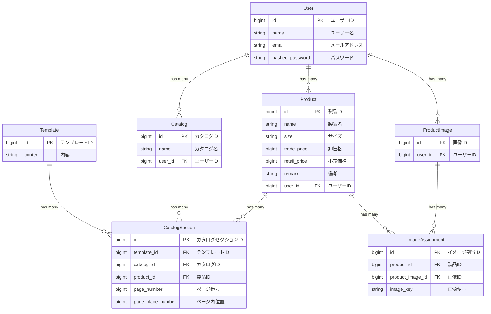

```mermaid
erDiagram
    User ||--o{ Catalog : "has many"
    User ||--o{ Product : "has many"
    User ||--o{ ProductImage : "has many"
    Template ||--o{ CatalogSection : "has many"
    Catalog ||--o{ CatalogSection : "has many"
    Product ||--o{ CatalogSection : "has many"
    Product ||--o{ ImageAssignment : "has many"
    ProductImage ||--o{ ImageAssignment : "has many"
    
    User {
        bigint id PK "ユーザーID"
        string name "ユーザー名"
        string email "メールアドレス"
        string hashed_password "パスワード"
    }
    
    Catalog {
        bigint id PK "カタログID"
        string name "カタログ名"
        bigint user_id FK "ユーザーID"
    }
    
    Product {
        bigint id PK "製品ID"
        string name "製品名"
        string size "サイズ"
        bigint trade_price "卸価格"
        bigint retail_price "小売価格"
        string remark "備考"
        bigint user_id FK "ユーザーID"
    }
    
    ProductImage {
        bigint id PK "画像ID"
        bigint user_id FK "ユーザーID"
    }
    
    Template {
        bigint id PK "テンプレートID"
        string content "内容"
    }
    
    CatalogSection {
        bigint id PK "カタログセクションID"
        bigint template_id FK "テンプレートID"
        bigint catalog_id FK "カタログID"
        bigint product_id FK "製品ID"
        bigint page_number "ページ番号"
        bigint page_place_number "ページ内位置"
    }
    
    ImageAssignment {
        bigint id PK "イメージ割当ID"
        bigint product_id FK "製品ID"
        bigint product_image_id FK "画像ID"
        string image_key "画像キー"
    }
```