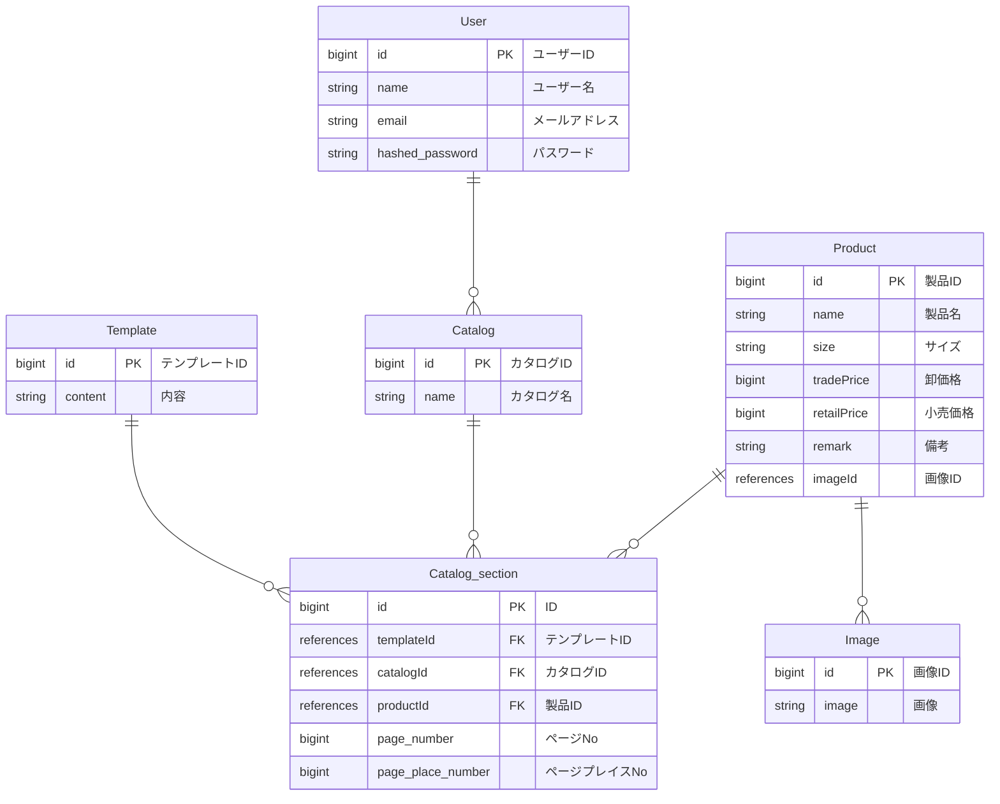

```mermaid
erDiagram
    User {
        bigint id PK "ユーザーID"
        string name "ユーザー名"
        string email "メールアドレス"
        string hashed_password "パスワード"
    }
    Catalog {
        bigint id PK "カタログID"
        string name "カタログ名"
    }
    Product {
        bigint id PK "製品ID"
        string name "製品名"
        string size "サイズ"
        bigint tradePrice "卸価格"
        bigint retailPrice "小売価格"
        string remark "備考"
        references imageId "画像ID"
    }

    Image {
        bigint id PK "画像ID"
        string image "画像"
    }
    Template {
        bigint id PK "テンプレートID"
        string content "内容"
    }
    Catalog_section {
        bigint id PK "ID"
        references templateId FK "テンプレートID"
        references catalogId FK "カタログID"
        references productId FK "製品ID"
        bigint page_number  "ページNo"
        bigint page_place_number  "ページプレイスNo"
    }
    User ||--o{ Catalog : ""
    Product ||--o{ Catalog_section : ""
    Catalog ||--o{ Catalog_section : ""
    Template ||--o{ Catalog_section : ""
    Product ||--o{ Image : ""
```